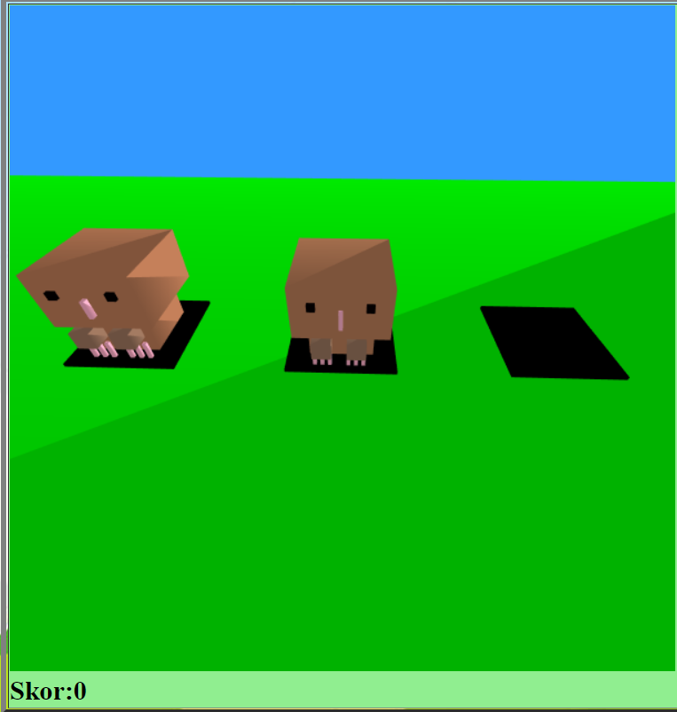

# Whac a Mole Game with WebGL
This is our project for Intorduction to Computer Graphics Course. This is a basic whac-a-mole game.

### Game Rules
1. When you click a mole, mole will die, your score will increase.
2. When a mole die, an animation will play.
3. You can win the game when you reach 100 score.
4. If you hit the space key the game will stop.

This game is 3D. We used direct lighting for light. 

